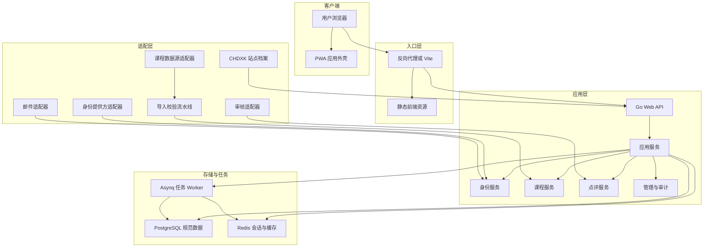
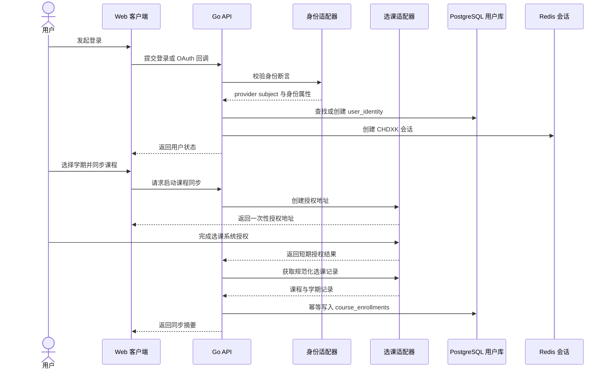
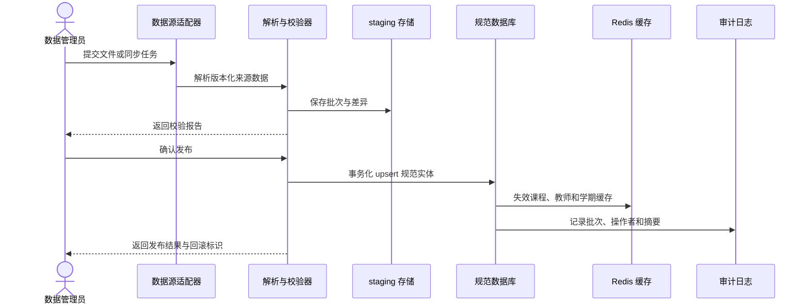
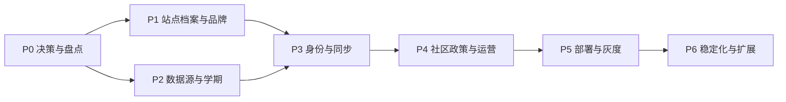

# CHDXK 本地化改造设计方案

*面向 CHDXK 单站部署的全面本地化改造设计；基于当前仓库源码盘点，版本 v0.1，更新时间 2026-09-01。*

---

## 🎯 文档定位与结论

### 文档目的

本文档把当前仓库从 SJTU-jCourse 上游项目改造成 CHDXK 本地化产品时需要处理的事项，整理为可执行的设计基线。范围覆盖：

- 产品身份、品牌、文案、PWA 和站点内容；
- 用户身份、邮箱规则、机构认证和课程同步；
- 课程、教师、开课、学期、搜索和数据导入；
- 点评、投票、积分、审核、通知和管理端；
- PostgreSQL、Redis、异步任务、邮件、外部服务和部署；
- 数据迁移、兼容策略、安全隐私、测试和发布验收。

本文档是设计和改造清单，不代表本地化功能已经实现。除当前仓库已有行为外，目标方案均应在对应任务完成并通过验收后才可视为落地。

### 结论摘要

推荐采用“保留核心业务、抽离本地配置、适配外部系统、增量迁移数据”的路线：

1. 保留课程浏览、教师信息、点评、投票、课程关注、通知、管理和审计等通用能力。
2. 将 SJTU 品牌、域名、邮箱域、身份提供方、课程数据源、学期格式、联系渠道和外部链接移出业务代码硬编码。
3. 第一阶段保持现有前端路由和 /api 接口契约，避免同时进行 API 改名、数据库表重命名和 UI 大改版。
4. 将 jAccount 变成可插拔的身份/教务适配器；CHDXK 的正式登录方式和课程同步方式由本地部署配置决定。
5. 现有数据库先做加法式迁移，增加身份映射、数据源、导入批次和来源标识；不直接删除旧字段、不清空现有点评、不覆盖无法确认来源的数据。
6. 先完成单站可运营版本，再评估多学校、多校区、多语言或多租户，不为尚未确认的需求提前引入复杂度。

### 范围与非目标

| 范围 | 本文覆盖内容 | 第一阶段非目标 |
| --- | --- | --- |
| 产品身份 | CHDXK 名称、简称、域名、Logo、联系方式、协议和隐私文案 | 不在没有视觉稿的情况下重做整体视觉系统 |
| 用户身份 | 邮箱登录、机构 OAuth、账号迁移、会话和权限 | 不在未确认身份方案前强行接入新的真实认证系统 |
| 课程数据 | 本地课程源、教师源、学期、导入、去重、数据质量 | 不凭空制造课程、教师或用户数据 |
| 社区业务 | 点评、投票、积分、审核、通知、管理员操作 | 不擅自改变积分经济、点评版权或内容处理政策 |
| 技术架构 | 配置分层、适配器、数据库兼容、部署与验收 | 不将单站直接改造成完整多租户平台 |
| 交付方式 | 设计文档、改造清单、阶段门禁、回滚方案 | 不把规划文档当作代码实现或生产验收证明 |

### 术语

| 术语 | 含义 |
| --- | --- |
| 本地化 | 将上游项目针对上海交通大学的身份、内容、数据和运行环境改造成 CHDXK 目标站点所需的行为 |
| 站点档案 | 面向单个部署实例的公开品牌、区域、联系、功能开关和数据源标识 |
| 身份提供方 | 为登录或账号绑定提供身份断言的系统，例如邮箱验证、机构 OAuth 或其他 OIDC/OAuth 服务 |
| 课程数据源 | 提供课程、教师、开课和选课结果的 CSV、API 或管理导入渠道 |
| 规范数据 | CHDXK 内部稳定使用的课程、教师、开课、用户和点评实体 |
| 来源记录 | 外部系统中的原始标识、来源快照、同步时间和映射关系 |
| 运行时配置 | 可由部署环境或管理员改变的配置；秘密值不属于公开运行时配置 |

## 🔎 当前基线与耦合点

### 仓库结构和运行链路

| 层次 | 当前实现 | 本地化影响 |
| --- | --- | --- |
| 前端 | frontend 下的 React、TypeScript、Vite、TanStack Router/Query、Tailwind、PWA、MSW、Vitest | 品牌和文案集中度有限，页面与 mock 中仍有 SJTU 邮箱和 jAccount 语义 |
| 后端 | backend 下的 Go/Gin/GORM，按领域、应用、基础设施和 Web 接口分层 | 核心领域可以复用，但配置结构、模块名、错误文案和适配器仍使用 jcourse/JAccount 语义 |
| 数据库 | PostgreSQL 17，依赖 pg_jieba 和 pg_trgm；迁移脚本为 0001 至 0013 | 搜索和数据结构已经具有中文场景假设；课程源标识和身份提供方标识不足 |
| 缓存与异步 | Redis 7、Asynq、任务 worker、课程热度、验证码、会话、限流和统计任务 | 需要确保本地化后的站点配置变化能触发缓存失效和任务重载 |
| 课程导入 | backend/cmd/importer 读取 backend/data/<semester>.csv，按课程代码和主讲教师聚合 | 目前是强约束的 CSV 导入，应抽象成来源适配器并加入校验、预览、幂等和回滚 |
| 认证 | 邮箱注册/验证码/密码登录为主，jAccount 用于课程选课同步 | 登录身份和教务选课身份被部分混在同一产品叙事中，需要拆分 |
| 前端 API | frontend/src/api 以 /api 为基地址，非安全方法前先获取 CSRF token | 首阶段应保留契约，只替换站点配置和外部适配行为 |
| 部署 | docker/docker-compose.yaml 提供 PostgreSQL 和 Redis；前端 Dockerfile 使用 Node 24 构建、Nginx 提供静态文件 | 尚未形成 CHDXK 的生产反向代理、秘密注入、备份、迁移和发布流程 |

### 已确认的 SJTU 绑定点

| 类别 | 当前锚点 | 影响 | 建议处理 |
| --- | --- | --- | --- |
| 代码命名 | Go module 为 jcourse，环境变量前缀为 JCOURSE，容器和数据库名为 jcourse | 全局改名会影响导入路径、迁移脚本、部署和既有数据 | 第一阶段保留内部技术命名，建立 CHDXK 对外标识；后续另行制定命名迁移 |
| 前端品牌 | frontend/src/config/brand.ts、frontend/pwa.config.ts、main.tsx、页眉页脚、页面标题 | 用户可见名称、PWA 安装名和邮件联系地址仍是上游品牌 | 统一由站点档案提供，并保留单一品牌入口 |
| 停机页 | frontend/public/maintenance.html 中含 SJTU选课社区 | 维护期间仍会暴露上游身份 | 使用同一品牌配置生成或手工同步停机页，增加版本检查 |
| 邮箱身份 | frontend/src/config/auth.ts、mock、后端 site_settings.go 默认使用 @sjtu.edu.cn | 新站点可能无法注册或会误收拦截 | 改成部署配置和管理员可见设置，默认值必须由 CHDXK 决策提供 |
| jAccount | backend/config/config.go、config.example.yaml、internal/infrastructure/jaccount、课程同步控制器和前端同步弹窗 | 真实认证端点、回调、课程接口和 UI 文案全部具有机构特定性 | 抽象身份/选课适配器；jAccount 仅作为可选实现 |
| 上游网址 | backend/loadtest 中的 course.sjtu.plus，前端当前开发代理已指向本地 API | 压测、文档、运行环境容易误打真实上游 | 所有目标地址通过环境变量或部署配置注入，并增加危险目标保护 |
| 外部链接 | user-points-page.tsx 仍指向 share.dyweb.sjtu.cn | 可能把 CHDXK 用户带到无关站点 | 逐条确认用途，改为 CHDXK 联系/帮助/积分说明或移除 |
| 邮件模板 | 验证码、封禁、频率限制通知中使用“选课社区” | 邮件发送后仍会显示上游产品名 | 模板变量化：站点名、支持邮箱、帮助链接、运营主体 |
| 内容说明 | about-content.tsx、faq-page.tsx 写有上海交通大学、jAccount、学校邮箱和既有运营承诺 | 文案会产生错误的身份、隐私和责任预期 | 依据 CHDXK 实际运营规则重新审核，不做机械替换 |
| 数据字典 | 课程、教师、院系、年级、语言、学期和教师关系以现有上游数据形态为基线 | 其他学校可能字段含义不同或缺少字段 | 建立源字段契约和规范化映射，保留未知值和来源 |
| 搜索 | pg_jieba 中文分词、tsvector、pg_trgm 索引 | 分词词典、字段组合和排序可能不适合目标数据 | 通过目标课程样本验证，不先更换搜索技术 |
| 构建发布 | Docker 和 loadtest 仍有上游镜像/域名/架构假设 | 部署时可能推送到错误仓库或依赖 ARM APM | 配置化镜像、域名和可选观测组件，默认关闭无关外部服务 |
| 历史迁移 | backend/cmd/migrate_v1 使用旧 JCourse/Django 表和 DSN | 可能误把上游旧数据导入 CHDXK | 单独做数据盘点和映射评审，未批准前不执行生产迁移 |

### 现有可复用的运行时能力

后续改造应优先复用已有能力，而不是另起一套平行系统：

- system_settings 已支持 current_semester、auth.email_domain、注册白名单、登录限制、点评审核与积分策略；
- Web 层已有 CSRF、Session、认证/管理员守卫、限流、Request ID、恢复和 CORS 中间件；
- domain/application/infrastructure 分层已能承载身份、课程、教师、点评、积分、公告和审计的适配；
- Redis 已集中处理会话、验证码、登录失败、课程缓存、点评缓存、热度和用户相关缓存；
- Asynq 已承载邮件、点评评分、热度、积分奖励、统计和审计任务；
- 前端已有 brand、system settings、API client、PWA、MSW 和页面标题入口，可作为配置收敛点。

### 基线验证记录

这份设计基于当前源码和本地基线验证，不能替代本地化后的验收：

| 检查 | 基线结果 | 备注 |
| --- | --- | --- |
| Go build | 通过 | 使用 backend 的现有依赖 |
| Go test | 通过 | 使用带 test 标签和 PostgreSQL/Redis 的本地服务 |
| Go vet | 通过 | 使用带 test 标签 |
| 前端 typecheck | 通过 | 使用项目声明的 pnpm/Node 组合 |
| 前端 test | 通过 | 2 个测试文件、6 个测试 |
| 前端 build | 通过 | PWA 构建成功 |
| 前端 lint | 未通过 | 当前有 select.tsx 和 calendar.tsx 的 Tailwind 类冲突提示，属于基线问题，不应在本地化文档任务中顺手修复 |
| API 运行 | 可用但默认 8080 在本机绑定受限 | 使用临时 18080 端口完成 CSRF、未登录鉴权和前端代理 smoke；生产部署需重新验证端口和反向代理 |

## 🧭 本地化目标与配置分层

### 三层边界

| 层 | 应包含 | 不应包含 |
| --- | --- | --- |
| 核心业务层 | 课程查询、教师关系、点评、投票、积分、通知、权限和审计 | 学校名称、邮箱后缀、OAuth URL、外部域名 |
| 站点档案层 | 名称、简称、Logo、语言、时区、联系方式、内容链接、功能开关、数据源标识 | 数据库密码、OAuth secret、SMTP 密码、API key 明文 |
| 外部适配层 | 身份提供方、选课系统、课程文件、审核服务、邮件服务、统计和对象存储 | 将某个提供方的字段直接泄漏到核心领域接口 |

### CHDXK 站点档案

建议定义一个面向单站的公开站点档案；单站版本可以先由后端配置和构建时前端配置组成，未来再迁移为受控的公共配置接口。

| 配置项 | 类型 | 所有者 | 例子或约束 |
| --- | --- | --- | --- |
| site_code | 字符串 | 部署者 | 稳定短码，建议为 chdxk；一旦写入来源映射不随意修改 |
| display_name | 字符串 | 产品/运营 | 用户界面显示名称 |
| short_name | 字符串 | 产品/运营 | PWA、窄屏和通知标题使用 |
| legal_name | 字符串 | 运营主体 | 协议、隐私说明和邮件签名使用 |
| public_base_url | URL | 部署者 | 只允许 HTTPS 生产地址 |
| support_email | 邮箱 | 运营者 | 反馈、找回和封禁申诉入口 |
| default_locale | 字符串 | 产品 | 首阶段可固定 zh-CN，但不把中文写死在业务服务中 |
| timezone | IANA 时区 | 部署者 | 当前 stats 默认 Asia/Shanghai，应由站点确认 |
| email_domains | 列表 | 运营者 | 只允许目标用户所属域名；空值策略需明确 |
| identity_providers | 列表 | 部署者 | email、oidc、oauth2 等；秘密仅在环境配置中 |
| course_sources | 列表 | 数据管理员 | CSV、HTTP API 或手工导入，记录 schema_version |
| course_sync_enabled | 布尔值 | 运营者 | 仅当已完成选课系统适配、授权和隐私评审时开启 |
| moderation_mode | 枚举 | 运营者 | off、manual、provider；默认先 manual |
| analytics_enabled | 布尔值 | 运营者 | 默认关闭，启用前审查数据收集和告知文案 |
| external_links | 显式映射 | 产品/运营 | 帮助、联系、规则等链接逐项确认，不允许隐式上游链接 |

### 配置优先级

推荐优先级如下：

1. 代码安全默认值：用于阻止危险行为，不能携带目标站点秘密。
2. 部署文件或环境变量：用于数据库、Redis、邮件、认证、审核、域名和密钥。
3. 数据库 system_settings：只保存管理员可修改的、非秘密、可审计的业务开关和阈值。
4. 前端运行时公共配置：仅暴露品牌、公开 URL、公开功能开关等可公开值。

后端秘密、OAuth client secret、SMTP 密码、审核服务密钥、API key 原文和会话密钥不得写入前端包、system_settings、日志、测试 fixture 或提交到仓库。

### 目标架构

### 目标状态的判定方式

每个本地化点均使用以下状态之一：

| 状态 | 含义 |
| --- | --- |
| 已确认现状 | 已在当前源码中找到并记录 |
| 待决策 | 需要 CHDXK 运营者或产品负责人明确答案 |
| 已设计 | 已有目标结构、迁移方式和验收标准 |
| 已实现 | 代码已经修改并通过针对性检查 |
| 已运行验证 | 在目标环境完成真实启动或端到端 smoke |
| 暂不改造 | 第一阶段明确保留，并记录原因和风险 |

## 🧩 分领域本地化设计

### 代码命名、仓库和发布身份

当前 Go module、包导入、配置前缀、数据库名、容器名、缓存 key 和部分文档沿用 jcourse。建议把“对外产品名”和“内部技术命名”分开：

- 第一阶段不批量替换 jcourse 包路径、数据库表名或 Redis key，避免产生大规模无业务价值的 diff。
- 对外可见的仓库描述、镜像名、服务名、站点标题、邮件名和文档统一改为 CHDXK。
- 若未来必须改 Go module，单独建立命名迁移分支，分批完成 import path、镜像、部署、监控和回滚，不与功能本地化混做。
- 环境变量可继续使用 JCOURSE 以保证兼容，但新部署文档应同时提供 CHDXK 前缀映射策略；是否最终改名需单独决策。
- 公开仓库中的示例配置、loadtest、CI 和脚本必须禁止默认指向上游生产域名。

验收：全仓库扫描后，所有剩余 jcourse/JCOURSE/SJTU 字符串都有归属说明：内部兼容、历史迁移、测试样例或待改造项；没有不经意的用户可见或生产地址引用。

### 品牌、页面标题和用户可见文案

#### 当前入口

- frontend/src/config/brand.ts：站点名、反馈邮箱和页面标题格式；
- frontend/pwa.config.ts：PWA name、short_name、描述、语言、主题色、快捷方式；
- frontend/src/main.tsx、common/page-title、layout：document.title、页眉、页脚和页面标题；
- frontend/public/maintenance.html：停机页的标题、ARIA 文案、品牌标识和说明；
- about-content.tsx、faq-page.tsx：站点定位、身份、隐私、内容管理、版权、教师联系和运营承诺；
- backend/internal/domain/account/notification/templates：验证码、封禁和频率限制邮件；
- mock fixtures：欢迎公告、演示账号、系统设置和邮箱域。

#### 目标设计

1. 建立统一的 public site profile 类型，至少提供 display_name、short_name、support_email、public_base_url、logo、locale、timezone 和 legal links。
2. 前端页面只从品牌/文案模块读取站点身份；组件不直接拼写 SJTU、jAccount、学校邮箱或上游域名。
3. 将文案按“产品功能文案”“安全/隐私承诺”“运营政策”分开。政策文案必须由实际运营者确认，不能只做文字替换。
4. 首阶段可以继续使用中文单语，但应把可变文案集中为稳定 key，为未来多语言保留迁移路径。
5. PWA manifest、favicon、maskable icon、OG 元信息、停机页、邮件和 README 的品牌必须成套替换。
6. 页面标题和 PWA 名称使用短名称，协议、邮件和页脚使用正式名称，避免不同位置出现多个版本。
7. 联系方式必须从一个配置源生成；不再在页面中散落硬编码邮箱和外部链接。

验收：

- 浏览器标题、页眉、页脚、登录注册、PWA 安装提示、停机页、邮件主题/签名全部显示 CHDXK 配置；
- 生产构建产物中没有未批准的 SJTU 品牌和 course.sjtu.plus 地址；
- FAQ、关于、隐私和版权文案经过 CHDXK 运营者审核，且不作出当前系统无法保证的匿名、删除或法律承诺；
- 无障碍名称、manifest short_name 和图标在窄屏/深色主题下仍可识别。

### 用户身份、认证和授权

#### 当前行为与问题

当前系统包含邮箱验证码注册、密码登录、密码重置、登录失败锁定、Session、CSRF 和管理员角色；auth.email_domain 与注册白名单已有 system_settings 支持。jAccount 代码主要用于课程选课同步，但前端产品叙事、账号 placeholder、关于页和 FAQ 又把 jAccount 描述成用户身份的一部分。

这会带来四类本地化风险：

- CHDXK 未必拥有 SJTU jAccount，继续显示 jAccount 会让用户误判登录方式；
- 课程同步系统的身份不一定等于站点登录身份；
- users.username、email 和密码迁移若直接覆盖，可能破坏点评归属和审计；
- 只把 @sjtu.edu.cn 替换为新域名，无法解决机构 OAuth、教师账号、校友账号或多域名规则。

#### 目标模型

将“站点账号”和“外部身份”拆成两个概念：

| 实体 | 责任 |
| --- | --- |
| user | CHDXK 内部用户、角色、封禁、创建时间和最后活跃时间 |
| user_identity | provider、外部 subject 的不可逆标识、绑定时间、验证状态和用户 ID |
| identity_provider | provider 的显示名、类型、启用状态和公开端点；秘密不进入数据库 |
| enrollment_identity | 用于课程同步的外部选课身份或授权引用；与站点登录身份可相同，也可不同 |
| session | Redis 中的会话和过期信息，使用现有 Session 机制 |

建议抽象以下接口，不让 domain 直接依赖 jAccount：

- StartLogin、HandleCallback、GetProfile；
- VerifyEmail、SendVerification、ResetPassword；
- StartEnrollmentSync、ExchangeEnrollmentCode、FetchEnrollments；
- ProviderError 的内部错误分类和面向用户的安全错误文案。

#### 登录方案决策

推荐优先级：

1. 若 CHDXK 有稳定的机构 OAuth/OIDC，使用机构身份登录，并保留邮箱验证作为找回或辅助绑定渠道。
2. 若没有机构身份系统，使用目标邮箱域的邮箱验证码 + 本地密码，或仅使用邮箱验证码；是否允许个人邮箱必须明确。
3. 若确实需要 jAccount，仅将其放进可选适配器，并在未配置时让课程同步明确显示“功能未启用”，不把 jAccount 写进整个站点品牌。

必须明确：

- 允许哪些邮箱后缀、是否允许多个后缀、是否区分学生/教师/校友；
- 一个邮箱能否绑定多个身份提供方；
- 外部 subject 是否只存 hash，hash 算法、盐和轮换方式是什么；
- 用户改邮箱、解绑、合并账号、注销和管理员强制解绑的规则；
- 登录身份与点评匿名展示之间的边界；
- 未成年人、教师和校友账号是否有不同权限；
- 账号迁移时如何处理现有 password_hash、username、email 和审计记录。

#### 安全边界

- 外部 provider 的 access token 只存在短期任务上下文或加密存储，不进入日志和前端；
- 回调 state、nonce、PKCE、redirect URI 和 cookie 属性必须由适配器和配置共同校验；
- CSRF、Session、限流、登录锁定和管理员守卫保持不变，改造后做回归；
- 认证错误向用户返回稳定、低泄露的文案，详细 provider 错误只进入脱敏结构化日志；
- 不用邮箱地址、姓名或可预测编号直接充当公开用户身份；
- API key 继续只显示一次原文，数据库保存 hash，生成、吊销和使用记录进入审计。

### 课程、教师、开课和本地数据源

#### 当前导入假设

当前 importer 以 semester 参数读取 data/<semester>.csv；数据解析后按课程代码和主讲教师代码聚合教师、类别、目标年级、语言和其他教师，再写入 courses、teachers 和 offered_courses。现有约束包括：

- teachers.code 全局唯一；
- courses 以 course code + main teacher 作为唯一组合；
- offered_courses 以 course + semester 唯一；
- course_enrollments 以 user + course + semester 唯一；
- courses 和 teachers 有 search_vector，数据库依赖 pg_jieba/pg_trgm；
- source system、source record ID、导入批次、校验摘要和撤销信息尚未成为一等数据。

#### CHDXK 数据源契约

在接入任何真实数据前，先定义版本化的 source schema：

| 数据域 | 最低字段 | 必须确认 |
| --- | --- | --- |
| 课程 | source_course_id、course_code、name、credit、department | 课程代码是否跨校区/专业唯一，是否存在中英文名 |
| 教师 | source_teacher_id、name | 教师代码是否稳定，重名和更名如何处理 |
| 开课 | semester、course reference、teacher references | 学期格式、校区、班号、语言、容量和培养方案 |
| 选课结果 | external_user_id、semester、course reference | 是否允许同步、最小权限、保存多久、是否保存原始课表 |
| 枚举 | category、language、target_year、department | 空值、未知值、历史值和显示排序 |
| 元数据 | source_name、schema_version、observed_at、source_hash | 重复导入、变更检测、失败重试和回滚 |

#### 目标导入流水线

1. 读取来源文件或 API，记录 source、schema_version 和导入批次。
2. 做编码、字段、枚举、学期、唯一性、引用完整性和异常数量校验。
3. 生成预览报告：新增、更新、未匹配教师、冲突课程、失效记录和被忽略行。
4. 在隔离事务或 staging 表中规范化课程、教师和开课。
5. 使用来源映射和幂等 key upsert；导入重复批次不产生重复课程、教师和开课。
6. 只有通过阈值和人工确认才发布到查询表、搜索向量、统计和缓存。
7. 导入成功后按课程、教师、学期粒度失效 Redis；失败时保留上一个可用版本。
8. 对来源中消失的记录标记 inactive 或 retired，不直接删除有点评、选课或审计关联的实体。

#### 数据质量门禁

- 学期必须能被解析为规范值，并保留原始显示值；
- 课程代码、教师来源 ID 和开课引用不能为空；
- 同一来源批次中不能出现无法解释的冲突主键；
- 课程名称、教师名称和院系名称应做空白、全角/半角、大小写和 Unicode 规范化；
- 未知枚举保留原值并进入报告，不静默映射成错误类别；
- 导入异常比例超过阈值时只生成报告，不发布；
- 任何覆盖课程主讲教师或名称的操作都要可审计、可回滚。

### 学期、校区、专业和课程语义

当前 system_settings 以 current_semester 作为公共配置，课程和选课表均以字符串 semester 关联。CHDXK 不应假定所有学校只使用一种学期格式。

目标设计：

- 引入 semester_normalizer，把来源值映射为稳定的 period_id、display_name、start_at、end_at、status；
- 规范值用于查询、排序、唯一约束和选课同步，显示值用于用户界面；
- 若存在校区、学院、专业、教学班或培养层次，将其作为开课维度，而不是拼接进课程名称；
- 保留原始 semester/source value 以支持追溯；
- current_semester 只表示默认查询/导入上下文，不代表数据库中只有一个学期；
- 关闭或切换当前学期时清理相关缓存并记录管理员审计；
- 课程详情需要区分“课程实体”和“某学期某校区的一次开课”。

需要特别评审现有 reviews 的唯一约束：当前是 user + course，而 review 本身有 semester 字段。如果 CHDXK 允许同一用户对同一课程跨学期发表多条点评，必须把策略和唯一索引一起改造；如果仍然只允许一条，则 UI 和文档要明确说明。

### 点评、社区和内容政策

#### 可复用能力

现有系统已覆盖点评创建、编辑修订、投票、评分、课程热度、频率限制、相似内容识别、管理员备注、封禁、积分奖励、课程通知和审计。

#### 不能机械本地化的部分

以下内容属于运营政策，不是品牌替换：

- 点评是否匿名、管理员能看到什么、是否允许教师回复；
- 点评版权授权、转载限制和删除/更正政策；
- 虚假信息、人身攻击、隐私泄露、广告和刷评的定义；
- 成绩/工作量/推荐分的含义和展示方式；
- 积分获得、兑换、转账、手续费和封禁期间的处理；
- 自动审核的误判申诉、人工复核和保留期限；
- 管理员对课程事实信息的修改边界。

建议把政策拆成可审计的配置和版本化文案：

| 策略 | 目标设计 |
| --- | --- |
| review_policy_version | 每次重要规则变更写入版本，点评提交时记录用户看到的版本 |
| moderation_mode | manual 为默认；provider 只提供建议，不直接替代人工决策 |
| review_visibility | 明确作者、管理员、教师和公众可见字段 |
| reward_policy | 积分奖励、上限、撤回和重复发放由配置和幂等 key 控制 |
| suspension_policy | 封禁原因、期限、申诉邮箱、恢复条件和通知模板 |
| correction_policy | 事实性修正、排版、删除和管理员备注各自留痕 |

如果 CHDXK 暂时没有成熟内容团队，建议第一阶段保留原有技术能力但关闭自动审核和积分扩张，只启用人工审核、基础限流和审计，待政策确认后再打开。

### 搜索、中文数据和展示排序

当前数据库使用 pg_jieba、tsvector 和 pg_trgm，对课程/教师/点评内容做中文搜索和模糊匹配。目标本地化不应先替换搜索技术，而应先验证目标数据：

- 课程名、教师名、院系和课程代码是否需要分词；
- 是否存在英文、繁体、拼音、简称、别名和数字混排；
- 哪些字段应该进入 search_vector，点评内容是否允许被搜索；
- pg_jieba 词典是否需要学校课程专名、教师姓名和常见缩写；
- 排序是精确代码优先、名称匹配优先、热度优先还是学期新鲜度优先；
- 搜索结果是否根据用户角色、学期和校区过滤；
- 新数据导入、课程修改、点评修改后 search_vector 如何异步刷新。

验收应使用一组脱敏的 CHDXK 真实样本，覆盖课程代码、简称、教师重名、中文长名称、英文课程、空院系和历史课程；不能只用上游 fixture 证明搜索可用。

### 前端路由、API、缓存和 PWA

#### 兼容策略

首阶段保持：

- API base URL 为 /api；
- 现有登录、注册、密码重置、课程、点评、教师、积分、API key、公告、系统设置、站点统计和管理接口路径；
- CSRF 获取方式、Session cookie 和非 GET 请求的重试逻辑；
- TanStack Query 的缓存和路由守卫；
- /course、/review、/teacher、/settings 等用户熟悉的路径。

只有在语义确实不适合 CHDXK 时，才新增兼容别名或版本化接口，不直接删除旧路径。

#### 前端本地化清单

- 把 brand.ts 从硬编码品牌改为站点档案入口；
- 将认证 placeholder、错误文案和说明从 jAccount 语义改成目标身份方案；
- 将课程同步按钮改成由 enrollment provider 能力决定；未启用时不显示死链；
- 重写 about、FAQ、用户协议、隐私、版权、教师联系和运营说明；
- 替换 PWA manifest、图标、主题色、快捷方式和维护页；
- 同步 MSW handlers、fixtures、演示账号邮箱和 system-settings 默认值；
- 清理 user-points-page.tsx 等页面中的未经确认外部链接；
- 检查页面标题、ARIA label、toast、空状态、错误状态和邮件链接；
- 保留 VITE_ENABLE_MOCKS 仅用于开发，不允许生产构建启用 mock；
- 为站点档案公共配置增加 schema 校验，缺少必需字段时构建失败。

### 管理端、运营和审计

现有管理能力包含用户、系统设置、站点统计、公告、API key 和审计日志。CHDXK 改造时应把它作为运营控制面，而不是让管理员直接编辑配置文件。

建议分为三类：

| 类型 | 示例 | 规则 |
| --- | --- | --- |
| 公开业务设置 | 当前学期、公开邮箱域、公开注册白名单、公告 | 公开读取，修改需要管理员权限和审计 |
| 风险策略 | 点评频率、投票上限、奖励开关、审核阈值、封禁期限 | 变更前显示影响，变更后清理缓存并记录前后值 |
| 基础设施秘密 | 数据库、Redis、SMTP、OAuth、审核 provider 密钥 | 只能由部署环境注入，管理端不显示原文 |

管理员初始化必须有一次性、可审计、可撤销或可轮换的 bootstrap 流程；不能在仓库中写默认管理员密码。涉及用户、点评、审核、设置、API key 和身份绑定的操作都要写入 audit_logs，并对详情做脱敏。

### 邮件、审核、统计和其他外部服务

| 集成 | 当前形态 | CHDXK 设计 |
| --- | --- | --- |
| SMTP | 配置化 SMTP sender，Asynq 异步发送验证码和封禁通知 | 站点名、support_email、帮助链接模板化；配置缺失时显式禁用并提示管理员 |
| JAccount | OAuth 与课程 Lessons API | 改成 provider adapter；默认关闭；不把 endpoint 和 client secret写死 |
| 内容审核 | Aliyun Green 适配器 | provider 可选；第一阶段 manual；审核结果、版本和人工覆盖需留痕 |
| Redis | 会话、缓存、验证码、限流、热度、任务队列依赖 | key 前缀增加 site_code 或部署隔离；切换站点配置后定义失效策略 |
| 百度统计 | 关于页明确写有访问统计 | 默认关闭，启用前审查告知、数据目的、域名和脚本来源 |
| 外部积分/帮助站点 | 前端存在 dyweb.sjtu.cn 链接 | 逐项迁移为 CHDXK 链接，找不到替代物则隐藏而不是保留上游链接 |
| APM/镜像仓库 | 构建和 Docker 可能包含 Aliyun ARM APM/镜像地址 | 改为可选配置，发布脚本默认只操作 CHDXK 仓库 |

所有外部集成都要满足：超时、重试上限、脱敏日志、熔断/禁用、健康检查、权限最小化和本地 fake 实现。外部服务故障不能阻塞课程浏览、已有点评读取和管理员登录。

### 安全、隐私和数据治理

本地化不是简单换站名。需要针对 CHDXK 的运营主体、用户群和部署地区重新审核说明文本和流程。这里不预先作出法律结论，设计只列出工程上必须可执行的控制：

| 数据 | 最小用途 | 默认处理 |
| --- | --- | --- |
| 邮箱 | 注册、验证、找回、通知和账号去重 | 加密传输，按运营政策保留；前台不公开 |
| 密码 hash | 本地登录 | 只存强 hash，禁止日志和导出 |
| 外部 subject | 绑定机构身份或选课身份 | 只存不可逆映射或加密引用，明确轮换和解绑 |
| 课程选课记录 | 展示我的课程、课程同步和个性化功能 | 最小字段、按学期隔离、可撤销同步 |
| 点评内容 | 社区展示、搜索、审核和统计 | 记录修订/审核轨迹，提供纠错和申诉入口 |
| IP、设备和访问日志 | 安全、限流、故障排查 | 设定访问权限和保留周期，避免把完整身份写入日志 |
| API key | 外部脚本访问 | 只展示一次原文，数据库保存 hash，支持吊销和审计 |
| 统计数据 | 站点运营 | 默认聚合，关闭不必要的第三方追踪 |

必须完成的工程检查：

- CORS 只允许目标前端来源，生产不使用 *；
- cookie 使用 Secure、HttpOnly、SameSite 和正确的反向代理信任配置；
- CSRF token、回调 state/nonce、密码重置 token 和验证码均有 TTL、一次性和限流；
- 日志、异常、任务 payload、邮件和审计 details 均做秘密/个人信息脱敏；
- 备份、导出、恢复和删除流程明确权限、审计和密钥管理；
- 外部课程源和身份 provider 的凭据不进入 Git、前端包、数据库公开设置或测试 fixture；
- 真实用户数据不能用于公开的 mock、截图、性能测试或文档示例。

## 🔁 关键流程与时序

### 认证与课程同步边界

### 课程数据导入

## 🗃️ 数据模型与迁移策略

### 现有实体到目标实体

| 当前表 | 当前责任 | 目标处理 |
| --- | --- | --- |
| teachers | 教师代码、姓名、院系、职称、搜索向量和最后学期 | 保留规范教师；增加来源映射和可选别名，不把来源 code 继续假设为全局稳定主键 |
| courses | 课程代码、名称、学分、院系、主讲教师、类别、语言、年级、评分聚合 | 保留课程实体；补充 source/校区/专业维度前先评估现有 code+teacher 唯一约束 |
| offered_courses | 课程在某学期的语言、年级、类别和教师 | 作为开课事实；必要时增加 campus、class_group、source_record_id |
| users | 站点账号、邮箱、角色、密码 hash、封禁状态 | 保留内部用户 ID；新增身份绑定表，避免用 username 兼任 provider subject |
| course_enrollments | 用户、课程和学期的关联 | 保留最小同步结果；增加来源、同步批次和撤销/过期语义 |
| reviews | 用户对课程的点评、评分、成绩文本、审核备注和计数 | 先保留；评审跨学期重复点评规则和唯一索引 |
| review_revisions | 点评修订历史 | 保留并记录政策版本/管理员修订原因 |
| review_votes | 用户对点评投票 | 保留；账号合并和注销需要明确处理 |
| course_notifications | 用户课程通知级别 | 保留；课程/开课维度改变时重新评估 key |
| course_hot_scores | 课程热度 | 保留；明确跨学期/校区聚合方式 |
| system_settings | 当前学期和站点可调业务设置 | 保留 key/value 兼容；增加类型、来源、公开性和版本校验，秘密不入库 |
| api_keys | 外部脚本 key hash 和角色 | 保留；目标域名、权限和吊销记录纳入审计 |
| announcements | 站点公告、时间窗口和链接 | 保留；链接必须走 CHDXK 允许列表/审核 |
| audit_logs | 管理员和系统操作记录 | 保留；增加 source/import/auth 相关 action，详情脱敏 |
| site_daily_stats | 日统计 JSONB | 保留；指标名称和公开范围重新定义 |
| point_records/point_rewards/transfers | 积分账本、奖励和转账 | 是否保留需运营决策；不得在未批准时沿用原有经济规则 |

### 建议新增的增量结构

以下是设计候选，不等于立即创建：

| 结构 | 关键字段 | 目的 |
| --- | --- | --- |
| user_identities | id、user_id、provider、subject_hash、verified_at、created_at、revoked_at | 一个内部账号绑定多个外部身份，支持 provider 替换和解绑 |
| enrollment_identities | user_id、provider、external_subject_ref、scope、expires_at、revoked_at | 将课程同步授权与站点登录身份分开 |
| data_sources | id、site_code、name、kind、schema_version、enabled、config_ref | 描述 CSV/API/手工数据源；秘密用 config_ref 指向环境 |
| source_records | source_id、entity_type、external_id、canonical_id、source_hash、observed_at、status | 追踪来源到规范实体的映射、变更和退役 |
| import_runs | id、source_id、semester、input_hash、status、stats、started_by、approved_by | 记录导入批次、差异、发布和回滚 |
| academic_periods | period_id、raw_value、display_name、start_at、end_at、status | 解决不同学期格式和显示名问题 |
| site_profile_public | key、value、version、updated_at | 若未来需要运行时公共配置，可替代散落前端常量；不放秘密 |

新增结构应使用编号迁移、唯一约束和 down migration；每个迁移都必须先在空库、复制库和带现有点评的库上演练。

### 数据迁移规则

1. 先建立只读盘点报告：行数、空值、唯一冲突、外部链接、上游品牌文本、当前学期和缓存 key。
2. 为每个用户、课程、教师和点评生成稳定的内部映射；不依赖名称作为唯一键。
3. 用户迁移优先保留内部 user ID，补建 user_identities；不能确认的外部身份进入待处理队列。
4. 课程和教师迁移先写 source_records，再更新规范表；冲突保留人工决策，不静默覆盖。
5. 点评、修订、投票、积分和审计通过原 user/course/review ID 保持关联。
6. 对旧 external URL、邮箱后缀和文案做报告后再替换；不要在数据库中全局字符串替换政策正文。
7. 每一批迁移产生可校验摘要、操作者、开始/结束时间和回滚点。
8. 回滚只回退新增映射和未发布批次；已经被用户使用的数据不得用无审计的 destructive delete 回滚。

### 兼容与回滚矩阵

| 变化 | 首选方式 | 回滚 |
| --- | --- | --- |
| 品牌/文案 | 配置或前端单点替换 | 恢复上一版静态资源和配置 |
| 邮箱域/注册规则 | 新增配置，旧值只读过渡 | 恢复白名单；已有账号不强制改邮箱 |
| 身份 provider | 双 provider 过渡、绑定表映射 | 禁用新 provider，保留原会话和内部账号 |
| 课程数据 | staging、差异预览、发布批次 | 标记批次失效，恢复上一批规范数据 |
| 数据库结构 | additive migration | 执行经过验证的 down migration 或停用新字段 |
| API | 保持旧路径，新增兼容字段 | 前端回退到旧字段，保留新字段不破坏读取 |
| 外部服务 | feature flag、超时和手动 fallback | 关闭 provider，继续提供核心读操作 |

## 🚦 分阶段实施与发布门禁

### 阶段总览

### P0：决策、盘点和冻结

交付：

- 确认 CHDXK 正式名称、简称、Logo、域名、运营邮箱和运营主体；
- 确认目标学校/校区/用户范围、课程数据源、身份方式和是否需要选课同步；
- 输出源字段契约、数据分类、政策文案清单和外部服务清单；
- 对现有数据库、课程数据、用户、点评、积分和旧迁移工具做只读盘点；
- 建立本地化字符串扫描清单和现有测试基线；
- 冻结第一阶段非目标，禁止无关的框架升级和大规模命名重构。

门禁：所有 P0 决策项已回答；任何未回答的项目都有明确默认值、负责人和截止条件。

### P1：站点档案、品牌和内容

交付：

- 统一前后端 public site profile；
- 替换品牌、页面标题、manifest、图标、停机页、邮件和外链；
- 重写关于、FAQ、隐私、协议、版权、教师联系和维护说明；
- 同步 MSW、fixture、示例配置和 README；
- 扫描产物和用户可见文案，清理不允许的 SJTU/jAccount/上游 URL。

门禁：不接真实认证、不导入真实数据也能启动并访问全部公共页面；所有公开文案经运营者确认。

### P2：数据源、学期和搜索

交付：

- 数据源 adapter 和版本化 schema；
- importer 的 staging、预览、校验、幂等、发布、失效和回滚；
- 学期规范化和 current_semester 兼容；
- source_records/import_runs/academic_periods 的增量迁移；
- 目标课程样本的搜索词典、排序和质量报告。

门禁：同一批次重复导入不重复；异常批次不发布；失败后旧版本可读；课程/教师/开课关联完整。

### P3：身份和课程同步

交付：

- provider-neutral 身份接口；
- user_identities 和 enrollment_identities；
- 目标邮箱/机构登录和回调安全检查；
- 选课系统适配器或明确关闭并隐藏同步入口；
- 账号迁移、绑定、解绑、注销和恢复流程；
- fake provider、回调重放、过期授权和外部故障测试。

门禁：登录、注册、退出、重置、管理员守卫、CSRF、限流和课程同步均可用；没有真实 token、密码或外部身份泄露。

### P4：社区政策和运营控制

交付：

- 确认点评政策、版权、隐私、教师回复、审核、申诉和积分规则；
- 将政策阈值、奖励和审核模式接入 system_settings 或配置；
- 完善管理员 bootstrap、审计、公告、API key 和数据导入权限；
- 配置邮件、人工审核队列、失败重试和运营告警。

门禁：所有高风险操作可审计、可解释、可回滚；用户看到的政策版本与提交/审核记录一致。

### P5：部署、灰度和回滚

交付：

- CHDXK 的环境变量模板、秘密管理、反向代理、TLS、健康检查和备份；
- PostgreSQL/Redis 持久卷、迁移运行顺序、worker 启停和任务幂等；
- CI 中 backend/frontend 的版本、lint、test、build 和安全扫描门禁；
- staging 导入脱敏数据，完成公共页面、登录、课程浏览、点评、管理和回滚 smoke；
- 生产灰度、只读 fallback、事故联系人和发布记录。

门禁：能从干净环境恢复；健康检查和日志不含秘密；外部 provider 全部可禁用；回滚演练成功。

### P6：稳定化和扩展

可选工作：

- 多数据源和来源优先级；
- 多校区/多学期/多语言；
- 用户数据导出、注销和隐私自助流程；
- E2E、性能、可观测性和数据质量 dashboard；
- 若确有需求，再评估多站点/多租户。

## 📋 改造工作分解

### P0：阻塞性事项

| ID | 范围 | 当前锚点 | 目标与验收 | 依赖 |
| --- | --- | --- | --- | --- |
| GOV-001 | 站点身份 | README、brand.ts、pwa.config.ts | 确认正式名、简称、域名、Logo、邮箱、运营主体；形成站点档案 | 负责人决策 |
| GOV-002 | 用户范围 | auth 配置、FAQ | 确认目标用户、邮箱域、教师/校友策略和机构边界 | 负责人决策 |
| GOV-003 | 数据权限 | importer、jAccount、选课同步 | 确认课程源所有权、同步授权、保留期和撤销方式 | 数据/运营负责人 |
| REP-001 | 内部命名 | go.mod、JCOURSE 配置、compose | 决定首阶段保留内部 jcourse 命名还是另开命名迁移；形成允许残留清单 | GOV-001 |
| BRD-001 | 站点档案 | brand.ts、system settings | 前后端读取统一公开档案，缺字段时安全失败 | GOV-001 |
| BRD-002 | 品牌资源 | PWA、维护页、favicon、页眉页脚 | 构建产物、manifest、停机页和页面标题无未批准上游品牌 | BRD-001 |
| BRD-003 | 政策文案 | about-content、faq-page、邮件模板 | 完成 CHDXK 协议/隐私/版权/内容/联系方式审阅 | GOV-001、GOV-002 |
| AUTH-001 | 认证决策 | config JAccount、auth 页面 | 选定 email、OIDC/OAuth、jAccount 或组合方案，记录关闭能力 | GOV-002 |
| DATA-001 | 来源契约 | importer/parser.go | 定义课程、教师、开课、选课和枚举 schema_version | GOV-003 |
| DATA-002 | 学期规则 | current_semester、semester 字段 | 定义规范 period、显示值、校区和历史数据策略 | DATA-001 |
| SEC-001 | 秘密边界 | config.example、Docker、日志 | 秘密只在环境注入；扫描 Git、构建产物和日志样例 | GOV-003 |
| OPS-001 | 环境基线 | docker-compose、Dockerfile、CI | 明确 Node/Go/PostgreSQL/Redis 版本、端口、域名和镜像仓库 | REP-001 |
| QA-001 | 基线门禁 | CI 与本地命令 | 固定 backend build/test/vet 与 frontend lint/typecheck/test/build 基线 | 无 |

### P1：首个可运营版本

| ID | 范围 | 当前锚点 | 目标与验收 | 依赖 |
| --- | --- | --- | --- | --- |
| AUTH-002 | 邮箱规则 | auth.ts、site_settings.go、mock | 邮箱后缀/白名单运行时可配置，前端 fallback 与后端一致 | AUTH-001 |
| AUTH-003 | provider 抽象 | internal/domain/jaccount、container.go | domain 不直接依赖 jAccount；fake provider 可完成单测 | AUTH-001 |
| AUTH-004 | 身份映射 | users、auth application | 增加 user_identity；登录、绑定、解绑、合并有审计 | AUTH-003 |
| AUTH-005 | 课程同步 | enrollment controller、sync dialog | 目标 provider 未启用时无死链；启用后有授权、TTL、重放和故障测试 | AUTH-003、DATA-002 |
| DATA-003 | 导入 staging | cmd/importer | 支持预览、差异、阈值、幂等、发布和回滚 | DATA-001 |
| DATA-004 | 来源映射 | courses、teachers、offered_courses | 记录 source_id/external_id/source_hash，不用名称作唯一键 | DATA-003 |
| DATA-005 | 退役语义 | importer、查询服务 | 来源消失记录标记 retired，不删除已有点评关联 | DATA-004 |
| SRCH-001 | 中文搜索 | pg_jieba、tsvector、trgm | 目标数据样本覆盖中文/英文/别名/代码，搜索向量刷新可验证 | DATA-001 |
| REVIEW-001 | 社区政策 | review application、FAQ | 明确匿名、审核、教师回复、版权、申诉和删除规则 | BRD-003 |
| REVIEW-002 | 点评唯一性 | reviews 唯一索引 | 决定跨学期点评策略，并同步约束、接口和 UI | DATA-002、REVIEW-001 |
| REVIEW-003 | 积分策略 | point settings、reward tasks | 明确是否保留积分/转账/奖励，禁用时账本和 UI 行为一致 | REVIEW-001 |
| MAIL-001 | 邮件模板 | account/notification/templates | 站点名、邮箱、帮助链接和语言变量化，失败任务可重试 | BRD-001、SEC-001 |
| MOD-001 | 内容审核 | moderation/aliyun.go | provider 可选、默认人工；敏感结果和人工覆盖可审计 | REVIEW-001、SEC-001 |
| API-001 | 公共档案接口 | api/system-settings、hooks | 如需运行时档案，增加版本化、缓存和公开字段白名单 | BRD-001 |
| UI-001 | 交互文案 | auth/course/review/admin pages | 清理 jAccount、SJTU 和上游语义，所有空态/错误态与目标政策一致 | BRD-003 |
| UI-002 | mock 与 fixture | mocks/handlers、fixtures | mock 域名、邮箱、公告和设置与真实配置契约一致 | BRD-001、AUTH-002 |
| UI-003 | 外链和统计 | user-points、about、analytics | 每个外链有 owner 和用途；未确认链接不进入生产 | BRD-003 |
| ADMIN-001 | 运营控制 | system settings、admin pages | 设置分级、前后值审计、缓存失效和危险操作二次确认 | REVIEW-001 |
| ADMIN-002 | bootstrap | users、部署脚本 | 无默认管理员密码；一次性初始化和轮换可验证 | SEC-001、OPS-001 |
| MIG-001 | 历史数据 | migrate_v1、现有库 | 输出旧数据盘点和映射报告；未经批准不执行导入 | GOV-003 |
| OPS-002 | 外部依赖 | SMTP、Redis、Asynq、moderation | 每个外部服务可禁用，核心读路径不依赖其成功 | SEC-001 |
| TEST-001 | 契约测试 | API modules、router、mocks | 前后端 DTO、错误码、认证和 CSRF 契约有自动化覆盖 | API-001、AUTH-003 |
| TEST-002 | 数据测试 | importer、repository | 空输入、重复批次、冲突、失败回滚和退役记录有测试 | DATA-003 |

### P2：稳定化和扩展

| ID | 范围 | 目标与验收 | 依赖 |
| --- | --- | --- | --- |
| PLAT-001 | 多数据源 | 同一规范课程可映射多个来源，来源优先级可解释 | DATA-004 |
| PLAT-002 | 多校区/多培养层次 | 开课维度支持 campus/program/teaching_group，查询和唯一约束无歧义 | DATA-002 |
| PLAT-003 | 多语言 | 文案、课程名和枚举有 locale fallback，未翻译内容不丢失 | BRD-001、UI-001 |
| PRIV-001 | 用户自助 | 导出、解绑、注销、点评更正和申诉流程可审计 | AUTH-004、REVIEW-001 |
| OBS-001 | 可观测性 | provider、导入、任务、API、数据库和缓存有脱敏指标/告警 | OPS-002 |
| E2E-001 | 端到端 | clean boot、登录、课程、点评、管理、停机和回滚 smoke 可重复 | P1 全部 |
| PERF-001 | 性能 | 目标数据规模下搜索、课程详情、批量导入和缓存命中率有基线 | DATA-003、SRCH-001 |
| REL-001 | 生产恢复 | 备份、恢复、迁移、worker 重启、Redis 重建和故障降级有演练记录 | OPS-001、OBS-001 |

## 🔌 API 与兼容策略

### 第一阶段接口原则

| 原则 | 具体做法 |
| --- | --- |
| 路径稳定 | 保留现有 /api/auth、/api/course、/api/review、/api/teacher、/api/user、/api/admin 等分组 |
| 字段兼容 | 新增字段优先可选；删除或改义前先双读/双写并给出迁移期 |
| provider 隔离 | API 返回能力和状态，不暴露 jAccount 类型、内部 OAuth token 或 provider 私有错误 |
| 错误稳定 | 保留 HTTP 状态和内部错误分类，用户文案从站点文案配置读取 |
| 配置公开 | system_settings 只公开标记为 public 的键；秘密和内部 URL 永不下发 |
| 缓存一致 | 配置、课程导入、身份解绑、权限变更后明确失效 key 和 TTL |
| mock 同步 | MSW 处理器和 fixture 视为接口消费者，和真实后端 DTO 一起更新 |

### 建议新增的能力接口

是否新增需结合最终方案决定，名称仅作为设计占位：

- GET /api/site-profile：返回版本化的公开站点档案；
- GET /api/auth/providers：返回启用的登录能力和显示文案；
- POST /api/auth/provider/:provider/start：开始外部登录；
- GET /api/auth/provider/:provider/callback：处理一次性回调；
- POST /api/course/enrollment-sync/:provider/start：开始选课同步；
- POST /api/course/import/preview：管理员预览导入差异；
- POST /api/course/import/:run_id/publish：管理员发布已校验批次；
- GET /api/course/import/:run_id：查看批次状态、差异和回滚信息。

这些接口不得在 provider 未启用时返回伪成功；不能用前端隐藏按钮代替后端授权。

## ✅ 验收、测试与检查清单

### 静态盘点

- 扫描 frontend、backend、docker、CI、README、邮件模板、PWA、停机页和测试 fixture；
- 对 SJTU、jAccount、@sjtu.edu.cn、course.sjtu.plus、dyweb.sjtu.cn、选课社区、jcourse、JCOURSE 做 allowlist 扫描；
- 扫描 HTTP/HTTPS URL、mailto、OAuth redirect、镜像仓库和 APM 配置；
- 确认构建产物、source map、PWA manifest、邮件 HTML 和日志样例不泄露秘密；
- 检查所有新增配置都有示例、默认值、验证、文档和失败行为。

### 后端

- go build ./...
- go test -tags test ./...
- go vet -tags test ./...
- 空配置、占位 secret、错误邮箱域、错误 URL、provider disabled、无效学期和错误来源文件测试；
- PostgreSQL 迁移从空库和现有数据副本成功；
- Redis/Asynq 重启后任务可重试且不重复发放积分、不重复发送危险通知；
- 认证回调 state/nonce/PKCE、过期 token、重放、解绑和权限变更测试；
- 数据导入重复、冲突、部分失败、旧版本保留、退役和回滚测试；
- API 对旧前端和新站点档案客户端保持兼容。

### 前端

- pnpm install --frozen-lockfile
- pnpm lint
- pnpm typecheck
- pnpm test
- pnpm build
- 公共页面、登录/注册、密码重置、课程列表/详情、点评、教师、我的课程、管理端和停机页 smoke；
- 验证品牌、页面标题、PWA manifest、主题色、Logo、反馈邮箱和外链；
- 验证 provider 未启用时的空态、错误态和隐藏逻辑；
- 验证 MSW 与真实 API 的 DTO、错误码、CSRF 和缓存行为一致；
- 窄屏、键盘导航、屏幕阅读器名称、中文长文本和深色主题检查。

### 真实环境 smoke

1. 从干净环境启动 PostgreSQL、Redis、API、worker、静态前端和反向代理。
2. 执行迁移并检查扩展、表、索引、约束和 system_settings。
3. 打开公共首页、课程列表、课程详情、FAQ、关于和维护页。
4. 使用 fake provider 完成注册/登录/退出/重置，不调用真实机构账户。
5. 导入一批脱敏目标课程，重复导入一次，确认无重复并检查差异报告。
6. 创建、编辑、投票、审核、撤回一条测试点评，确认修订、积分和审计策略符合决策。
7. 禁用 SMTP、审核 provider、课程同步和 Redis，确认核心读路径的降级行为。
8. 备份数据库，发布一批可回滚变更，执行回滚并确认点评/用户/审计仍完整。

### 生产发布门禁

- 目标域名、CORS、cookie、TLS 和反向代理 header 已核对；
- secrets 由部署系统提供，仓库和镜像中没有真实凭据；
- 数据库备份、恢复、迁移和 down/recovery 方案经过演练；
- provider、邮件、审核、统计和导入均有超时/禁用开关；
- 管理员、支持邮箱、事故联系人和内容申诉路径已验证；
- 生产数据导入有审批、预览、发布、回滚和审计；
- 发布后可观察错误率、认证失败、导入失败、任务积压、数据库连接和缓存状态。

## ⚠️ 风险、依赖和待决策项

### 必须由 CHDXK 负责人回答的问题

| 编号 | 问题 | 推荐默认值 | 阻塞范围 |
| --- | --- | --- | --- |
| D-01 | CHDXK 的正式中文名、英文名、简称、Logo 和品牌色是什么 | 先使用配置占位，不把上游品牌复制为默认值 | 品牌、PWA、邮件 |
| D-02 | 运营主体和公开联系邮箱是什么 | 使用独立 support_email，不复用 course@sjtu.plus | 协议、隐私、客服 |
| D-03 | 目标学校、校区、用户和邮箱范围是什么 | 单站、一个明确用户群；多域名显式白名单 | 注册、数据导入 |
| D-04 | 登录方式是什么 | 首选目标机构 OIDC/OAuth；没有则邮箱验证/密码 | AUTH 全部 |
| D-05 | 是否需要课程选课同步 | 未完成 provider、授权和隐私评审前关闭 | 我的课程、course sync |
| D-06 | 课程数据从哪里来、授权范围和更新周期是什么 | 先用版本化 CSV + staging，确认后再接 API | importer、学期 |
| D-07 | 课程是否按校区/专业/教学班区分 | 不确定时保留来源字段，不把维度拼进名称 | schema、唯一约束 |
| D-08 | 是否保留点评、投票、积分、转账和奖励 | 首版保留点评读取/提交，积分经济默认待审 | review、point |
| D-09 | 点评版权、匿名、教师回复、审核和申诉政策是什么 | 先人工审核和审计，政策确认后开自动化 | FAQ、moderation |
| D-10 | 是否使用第三方邮件、内容审核、统计和 APM | 默认可关闭，逐项确认数据流和替代方案 | 外部集成 |
| D-11 | 部署域名、服务器架构、镜像仓库和备份位置是什么 | staging/production 分离，秘密由部署系统注入 | Docker、CI、发布 |
| D-12 | 是否要导入上游用户、点评和积分数据 | 默认不导入用户/敏感数据；需批准后做只读映射 | migrate_v1 |
| D-13 | 是否需要多语言、多站点或多租户 | 第一阶段单站中文；扩展另立项目 | 架构复杂度 |
| D-14 | 数据保留、导出、注销、删除和事故响应规则是什么 | 先建立工程流程和审计，不做无法兑现的承诺 | 隐私、运营 |

### 主要风险与缓解

| 风险 | 触发条件 | 缓解 |
| --- | --- | --- |
| 品牌替换不完整 | 停机页、邮件、PWA 或 fixture 仍显示上游内容 | 建立字符串/URL allowlist 扫描，并在构建产物中复核 |
| 认证方案误判 | 把 jAccount 当成 CHDXK 登录前提 | 登录 provider 与选课 provider 分离，未启用时后端 fail closed |
| 数据覆盖或错配 | 课程代码重用、教师重名、来源 ID 变化 | source_records、预览、人工确认、稳定内部 ID 和批次回滚 |
| 点评归属丢失 | 用户合并/邮箱替换/账号迁移 | 保留内部 user ID，迁移只新增映射，先做复制库演练 |
| 学期语义错误 | 目标学校学期格式不同或跨校区 | period normalizer、原始值保留和目标样本验证 |
| 外链泄露上游身份 | 未扫描的链接、邮件或统计脚本 | URL inventory、CSP/允许列表和逐项 owner |
| 积分政策不适用 | 沿用上游奖励/转账规则 | 首版可关闭；政策、账本和 UI 一起变更并审计 |
| 外部服务拖垮核心 | SMTP/审核/OAuth 超时或重试风暴 | 超时、重试上限、熔断、异步和手动 fallback |
| 数据库迁移不可逆 | 直接改名、删除或全局替换 | additive migration、备份、staging、down migration 和回滚演练 |
| 运行环境漂移 | Node/Go/PostgreSQL/Redis/镜像版本不一致 | 固定版本、CI 矩阵、健康检查和 clean boot |
| 过早多租户 | 目标范围未定就引入 tenant 隔离 | 单站配置优先，记录未来边界，延后结构性改造 |

## 🔗 参考与代码锚点

### 仓库内参考

- [根 README](../README.md)：项目功能、目录和本地运行入口。
- [后端 README](../backend/README.md)：后端依赖、配置和任务说明。
- [前端 README](../frontend/README.md)：前端工具链、PWA 和开发命令。
- [根 AGENTS.md](../AGENTS.md)：仓库级操作、验证和 Git 安全约束。
- [backend/AGENTS.md](../backend/AGENTS.md)：后端分层、测试和迁移约束。
- [frontend/AGENTS.md](../frontend/AGENTS.md)：前端编辑、格式化和验证约束。
- [后端配置定义](../backend/config/config.go)：运行时配置、默认值和校验。
- [后端示例配置](../backend/config/config.example.yaml)：数据库、邮件、JAccount 和课程同步配置入口。
- [站点设置注册表](../backend/internal/app/site_settings.go)：当前学期、邮箱域、审核、积分和频率限制。
- [Web 路由](../backend/internal/interface/web/router.go)：认证、课程、点评、管理、公告和系统设置接口。
- [数据库实体](../backend/internal/infrastructure/repository/entity.go)：教师、课程、开课、用户、点评、积分和站点实体。
- [迁移脚本目录](../backend/script/)：当前 0001 至 0013 的数据库演进记录。
- [课程导入入口](../backend/cmd/importer/)：CSV 解析、聚合和导入流程。
- [前端品牌配置](../frontend/src/config/brand.ts)：当前品牌名、反馈邮箱和页面标题。
- [前端认证配置](../frontend/src/config/auth.ts)：当前邮箱域和密码校验默认值。
- [PWA 配置](../frontend/pwa.config.ts)：manifest、快捷方式、主题和预缓存策略。
- [前端 API 客户端](../frontend/src/api/client.ts)：CSRF、Session、请求和错误处理。
- [Docker Compose](../docker/docker-compose.yaml)：本地 PostgreSQL/Redis 服务和持久卷。
- [许可证](../LICENSE)：仓库许可文本；本地化和再发布前须按该文件及项目治理要求处理。

### 上游和目标仓库

- [SJTU-jCourse 上游仓库](https://github.com/SJTU-jCourse/next)：当前代码基线的上游来源。
- [CHDXK 目标仓库](https://github.com/RinnMoe/CHDXK)：本地化改造后的目标远程仓库。

### 文档维护规则

- 任何本地化实现合并后，更新本文对应条目的状态、文件锚点、验证命令和遗留风险。
- 若运营政策、认证 provider、课程源或数据保留规则改变，先更新决策表，再改代码和公开文案。
- 不将秘密、真实用户数据、真实 OAuth 回调、生产 URL 凭据或未经脱敏的课程源放入本文档。
- 若未来引入多校区、多语言或多租户，先新增架构决策记录，再扩展本方案，不直接覆盖单站假设。
